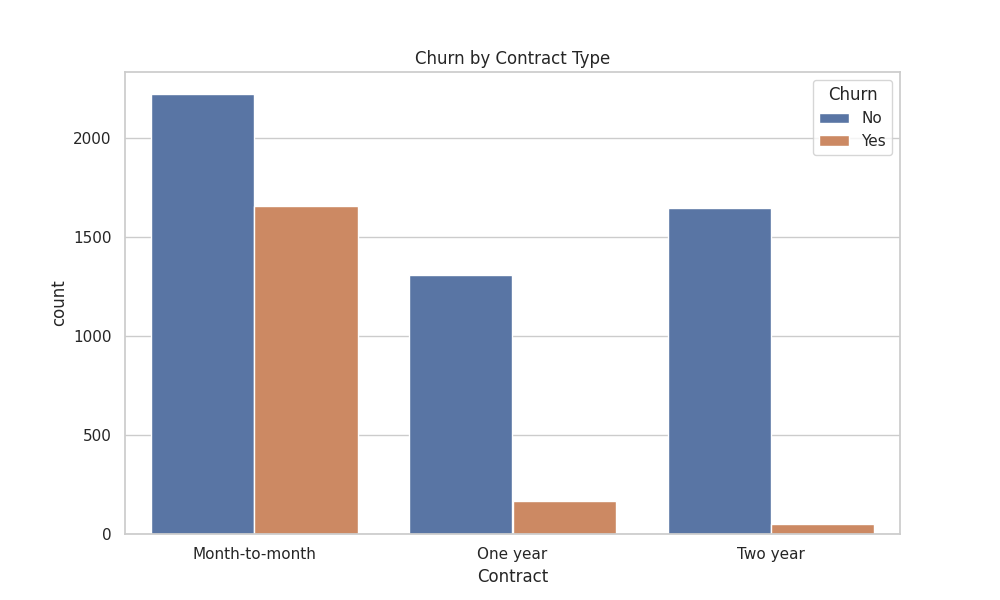
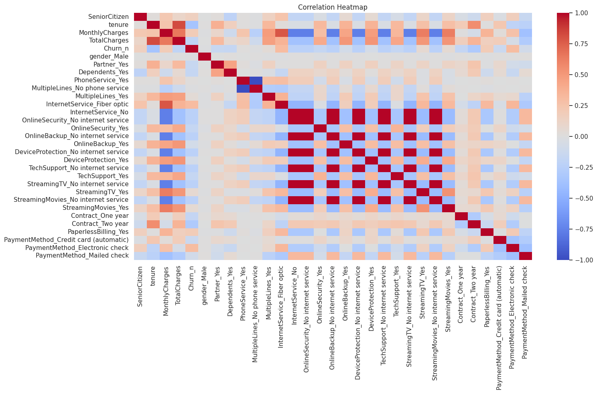

# 📊 Customer Churn Analysis

This project explores churn behavior among telecom customers using the **Telco Customer Churn Dataset**. It includes detailed EDA, visualization, and a simple machine learning model to predict churn.

---

## 📁 Dataset

- **Source:** [Kaggle - Telco Customer Churn](https://www.kaggle.com/datasets/blastchar/telco-customer-churn)
- ~7,000 customer records with features like service type, contract, charges, and churn status

---

## 🎯 Objective

Analyze customer behavior and identify patterns leading to churn using data visualization and logistic regression.

---

## 🛠️ Tools Used

- Python 🐍 (Google Colab)
- `pandas`, `numpy`
- `matplotlib`, `seaborn`
- `scikit-learn`

---

## 📈 Visual Explorations

### 🔹 Churn by Contract Type  

### 🔹 Correlation Heatmap  

---

## 🤖 Machine Learning (Bonus)

A basic **Logistic Regression** model was used to predict churn:
- Accuracy: ~79%
- Key Predictors: Contract type, tenure, monthly charges

---

## 🔍 Key Insights

- Customers with **month-to-month** contracts churn more frequently.
- **Higher monthly charges** correlate with higher churn risk.
- Customers with **longer tenure** are less likely to churn.

---

## 🚀 How to Run

1. Download or open the `churn_analysis.ipynb` notebook.
2. Upload the dataset (`WA_Fn-UseC_-Telco-Customer-Churn.csv`).
3. Run all cells in Google Colab or Jupyter Notebook.

---

## 💁‍♀️ Author

**Saloni Sangode**  
[GitHub: @codewithsaloni0506](https://github.com/codewithsaloni0506)

---

⭐ *Star this repo if you liked the project!*
